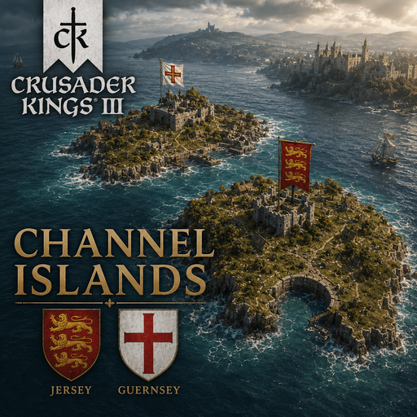

# Channel Islands Continued

A Crusader Kings III mod that adds the Channel Islands — Jersey, Guernsey, Alderney and Sark — as a playable county, de jure part of the Duchy of Normandy.

This is an unofficial continuation ("fork") of the original [Channel Islands](https://steamcommunity.com/sharedfiles/filedetails/?id=2222503799) mod by **Indyclone77**. The original mod's files were tied to CK3 1.9 and no longer worked on current game versions; this fork rebuilds the county against up-to-date vanilla files and expands it.

**Workshop page:** https://steamcommunity.com/sharedfiles/filedetails/?id=3783006059
**Source code (open source):** https://github.com/agrimpard/ck3-channel-islands

## What's in the county

- **Saint Martin** (Jersey)
- **Saint Peter Port** (Guernsey)
- **Alderney**
- **Sark**

County and barony names switch between their French and Norman/Anglo-Norman forms depending on whether the ruling culture is French or Norman.

## Historical setup

- The county's line of holders follows the real counts of Mortain/Avranches (the closest mainland Norman neighbours of the islands) from 1056 onward.
- **1204 break**: when Philip II Augustus annexed continental Normandy into the Kingdom of France, the islands historically stayed loyal to King John and passed to English suzerainty instead. The mod reproduces this: the county's liege switches from the Duke of Normandy to the King of England at 1204.1.1, matching the islands' real status as a Crown Dependency ever since.
- **867 Viking Age bookmark**: a dedicated, fictional-but-plausible local lord ("Anquetil") holds the county from 860 onward, owning nothing but the islands themselves. This makes it possible to start the 867 bookmark playing *only* the Channel Islands, as a vassal of whoever holds the Duchy of Normandy at that time, instead of inheriting a landholder's five other mainland counties.

## Changelog

### v1.0
- Full rebuild against current-version vanilla files (landed titles, province history, title history, map definition, `default.map`, province terrain, map object locators) to fix crashes and restore compatibility — the original mod's files were still based on CK3 1.9.
- Fixed a pre-existing bug where the Saint Peter Port province was split into disconnected pixel fragments on the province map.
- Added French localization (the original mod only shipped English strings).
- Added Alderney and Sark as two new baronies of the Channel Islands county — reusing what turned out to be two mis-painted, disconnected fragments of the Guernsey province in the original map art, now split off into their own provinces at the geographically correct spots.
- Rebuilt the county's title history end to end (see "Historical setup" above).

## Repository layout

This repository mirrors the mod's file structure as CK3 expects it (`common/`, `history/`, `localization/`, `map_data/`, `gfx/`), so it can be dropped directly into a CK3 `mod/<name>/` folder alongside a `descriptor.mod` file.

## Credits

- Original mod: **Indyclone77**.
- This fork's updates and additions: see Changelog above.
